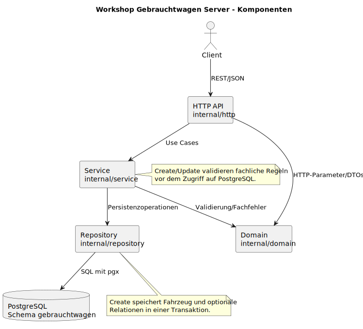
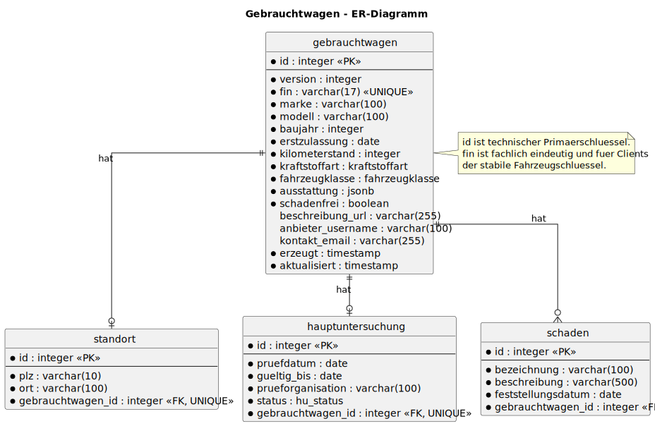
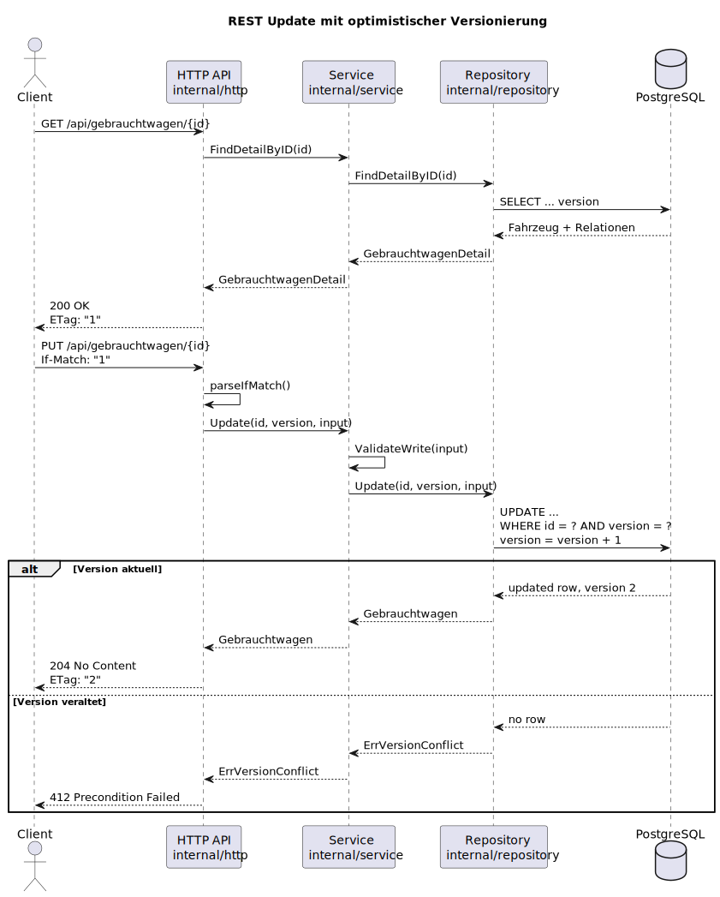

= Projekthandbuch Workshop Gebrauchtwagen Server
Anna Wiedemann, Gruppe 2
:doctype: book
:toc: left
:toclevels: 3
:sectnums:
:source-highlighter: highlight.js
:icons: font

== Ziel und Kontext

Dieses Projekt ist ein Go-REST-Server fuer das Gebrauchtwagen-Datenmodell aus
dem Softwareengineering-Workshop am 19.6.2026. Ziel war eine lauffaehige,
pruefungstaugliche Loesung innerhalb von vier Stunden: klein, nachvollziehbar,
gut testbar und mit echtem PostgreSQL-Backend.

Der Server bietet Healthchecks und CRUD-Endpunkte fuer `Gebrauchtwagen`.
Schreibende Requests koennen optional ueber `ADMIN_TOKEN` oder Keycloak/OIDC
geschuetzt werden.

== Team und Arbeitsweise

[cols="1,2",options="header"]
|===
| Person / Gruppe | Beitrag
| Anna Wiedemann, Gruppe 2 | Umsetzung, Test, Review und fachliche Entscheidungen im Workshop
| Codex | Analyse, Implementierungsvorschlaege, Codeaenderungen, Tests und Dokumentation
|===

Die Arbeit erfolgte iterativ mit kleinen, deutsch benannten Commits nach dem
Prinzip "Commit early, commit often".

== Architektur

Die Anwendung ist als kleine Schichtenarchitektur aufgebaut.

[cols="1,3",options="header"]
|===
| Schicht | Aufgabe
| `cmd/server` | Startet Konfiguration, Datenbankpool, Repository, Service und HTTP-Server
| `internal/http` | Routing, Request-/Response-Mapping, Statuscodes, Problem Details und CORS
| `internal/service` | Use Cases und Aufruf der fachlichen Validierung
| `internal/domain` | Datenmodell, DTOs, Enum-Werte, Validierung und fachliche Fehler
| `internal/repository` | PostgreSQL-Zugriff mit `pgx`, SQL-Queries und Transaktionen
| `internal/auth` | Optionaler Schreibschutz ueber `ADMIN_TOKEN` oder Keycloak/OIDC
|===

PlantUML-Quellen liegen unter `docs/diagramme/src/`.

* `komponenten.puml`: Komponentenuebersicht
* `er-diagramm.puml`: relationales Datenmodell
* `rest-update-sequenz.puml`: Update-Ablauf mit optimistischer Versionierung

== Datenmodell

PostgreSQL verwendet das Schema `gebrauchtwagen`. Die zentrale Tabelle
`gebrauchtwagen` besitzt einen automatisch vergebenen technischen
Primaerschluessel `id`. Die 17-stellige `fin` ist eindeutig und der fachliche
Fahrzeugschluessel fuer Clients.

Relationen:

* Ein Gebrauchtwagen hat optional genau einen Standort.
* Ein Gebrauchtwagen hat optional genau eine Hauptuntersuchung.
* Ein Gebrauchtwagen kann mehrere Schaeden haben.

Schema und Seed-Daten liegen unter `extras/compose/postgres/init/`.

== REST-Schnittstelle

[cols="1,2",options="header"]
|===
| Methode | Pfad
| `GET` | `/health/liveness`
| `GET` | `/health/readiness`
| `GET` | `/api/gebrauchtwagen`
| `GET` | `/api/gebrauchtwagen/{id}`
| `POST` | `/api/gebrauchtwagen`
| `PUT` | `/api/gebrauchtwagen/{id}`
| `DELETE` | `/api/gebrauchtwagen/{id}`
|===

Die Listenabfrage unterstuetzt Filter nach `marke`, `modell`,
`fahrzeugklasse`, `kraftstoffart` und `schadenfrei`. Paging erfolgt ueber
`page` und `size`; `count-only` liefert nur die Anzahl.

== Validierung und Fehler

Die fachliche Validierung liegt in `internal/domain` und wird aus
`internal/service` aufgerufen. Validiert werden unter anderem:

* Pflichtfelder `fin`, `marke`, `modell`, `fahrzeugklasse`, `kraftstoffart`
* `fin` mit genau 17 Zeichen
* bekannte Enum-Werte
* `kilometerstand >= 0`
* optionale relationale Daten wie Standort, Hauptuntersuchung und Schaeden

Fehler werden als `application/problem+json` zurueckgegeben.

== Optimistische Synchronisation

Das Datenmodell enthaelt `version`. Detailantworten liefern die aktuelle
Version als `ETag`, z.B. `"1"`. Updates muessen diese Version ueber
`If-Match` mitsenden. Bei erfolgreichem Update erhoeht PostgreSQL die Version.
Bei veralteter Version antwortet der Server mit `412 Precondition Failed`.

== Datenbank und Demo-Daten

Der Compose-Stack startet einen echten PostgreSQL-Container. Beim Start der
App wird der Demo-Datenbestand standardmaessig transaktional zurueckgesetzt.
Dadurch ist jeder Workshop-Test reproduzierbar.

Abschaltbar ist das Verhalten mit:

[source,powershell]
----
$env:RESET_DATABASE_ON_START="false"
----

== Authentifizierung

Der Server bleibt ohne Keycloak lauffaehig.

* Ohne `ADMIN_TOKEN` sind schreibende Endpunkte offen.
* Mit `ADMIN_TOKEN` brauchen `POST`, `PUT` und `DELETE` den passenden Bearer Token.
* Mit `AUTH_MODE=keycloak` prueft der Server Bearer Tokens gegen Keycloak/OIDC.

Die Bruno-Collection enthaelt einen Request, der ein Keycloak-Access-Token fuer
den Demo-Admin holt und als `adminToken` speichert.

== Tests und Qualitaetssicherung

Lokale Sammelpruefung:

[source,powershell]
----
.\scripts\check.ps1
----

Enthalten sind:

* `gofmt`
* `go vet`
* `go test ./...`
* `staticcheck`
* `govulncheck`

Getestet werden Validierung, Healthchecks, REST-Handler, Paging,
Versionierung, Auth-Bausteine und PostgreSQL-Repository-Logik.

== Betrieb

PostgreSQL starten:

[source,powershell]
----
docker compose -f extras/compose/postgres/compose.yml up -d
----

Kompletten Stack mit App starten:

[source,powershell]
----
docker compose -f extras/compose/postgres/compose.yml --profile app up -d --build
----

Keycloak fuer lokale Tests:

[source,powershell]
----
docker run -d --name workshop-keycloak -p 8080:8080 `
  -e KC_BOOTSTRAP_ADMIN_USERNAME=admin `
  -e KC_BOOTSTRAP_ADMIN_PASSWORD=admin `
  quay.io/keycloak/keycloak:26.2.5 start-dev
----

== Artefakte

* `README.md`: schnelle Start- und Testanleitung
* `docs/workshop-abgabe.md`: ausgefuellte Abgabevorlage
* `docs/demo-guide.md`: Vorfuehrablauf
* `docs/openapi.yaml`: schlanke OpenAPI-Beschreibung
* `bruno/`: manuelle REST- und Keycloak-Requests

== Offene Erweiterungen

* Keycloak-Realm als importierbare JSON-Datei versionieren
* PlantUML/AsciiDoctor-Rendering in CI automatisieren
* zusaetzlichen Image-Scan mit Trivy oder OWASP Dependency Check ergaenzen
